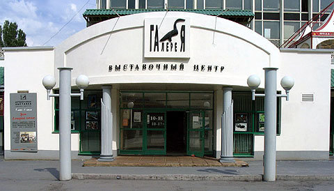
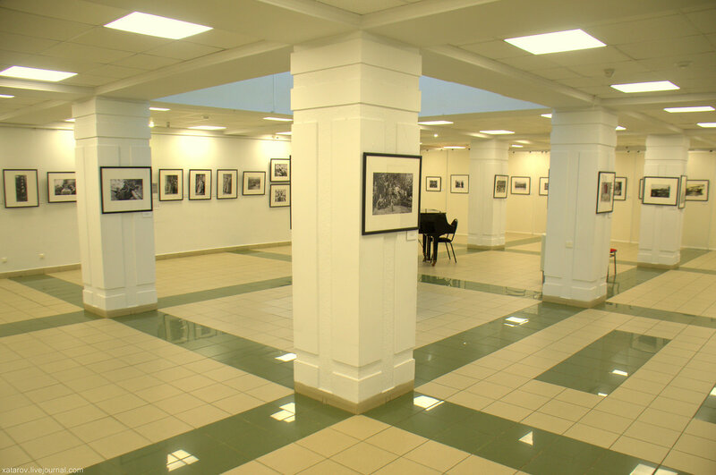

[Назад](/index.md)

### &nbsp;&nbsp;&nbsp;Выставочный центр «Галерея»
&nbsp;&nbsp;&nbsp;&nbsp;&nbsp;Выставочный центр «Галерея» - одна из самых крупных выставочных площадок в столице Удмуртии. Открыта в 1993 г. на Центральной площади Ижевска. В настоящее время здесь одновременно работают три выставочных зала.
&nbsp;&nbsp;&nbsp;&nbsp;&nbsp;Основная цель «Галереи» — организация художественных проектов, призванных знакомить ижевчан и гостей города с разными видами и направлениями изобразительного искусства. Приоритетная задача — поддержка и продвижение творчества художников Удмуртии. В течение года «Галерея» организует более 30 выставок.
&nbsp;&nbsp;&nbsp;&nbsp;&nbsp;«Галерея» принимает активное участие в городских и республиканских культурных проектах. На сегодняшний день центр широко представлен в информационном поле города и республики. Ежегодно «Галерею» посещает более 70 тысяч человек.
&nbsp;&nbsp;&nbsp;&nbsp;&nbsp;&nbsp;&nbsp;&nbsp;&nbsp;&nbsp;&nbsp;&nbsp;&nbsp;&nbsp;&nbsp;&nbsp;&nbsp;&nbsp;&nbsp;&nbsp;&nbsp;&nbsp;&nbsp;&nbsp;&nbsp;&nbsp;&nbsp;&nbsp;&nbsp;&nbsp;&nbsp;&nbsp;&nbsp;&nbsp;&nbsp;&nbsp;&nbsp;&nbsp;&nbsp;&nbsp;&nbsp;&nbsp;&nbsp;&nbsp;&nbsp;

&nbsp;&nbsp;&nbsp;&nbsp;&nbsp;Выставочные залы:
&nbsp;&nbsp;&nbsp;&nbsp;&nbsp;Большой зал – здесь проходят масштабные проекты, организованные в партнерстве с российскими музеями, галереями, творческими союзами, частными коллекционерами и художниками. Данные выставки становятся значимыми событиями в культурной жизни города и республики.
&nbsp;&nbsp;&nbsp;&nbsp;&nbsp;Малый зал предназначен для выставок камерного характера. В нём проводятся выставки самой разной направленности и тематики: от персональных выставок до коллективных проектов.
&nbsp;&nbsp;&nbsp;&nbsp;&nbsp;Открытый зал – территория свободного посещения и экспериментального творчества. Молодая выставочная площадка, дающая возможность заявить о себе творческим людям города и республики.
&nbsp;&nbsp; &nbsp;&nbsp; 

&nbsp;&nbsp;&nbsp;&nbsp;&nbsp;Билет по цене входа на выставку: 200 руб. – взрослый. 150 руб. – детский.

&nbsp;&nbsp;&nbsp;&nbsp;&nbsp;Режим работы:  
&nbsp;&nbsp;&nbsp;&nbsp;&nbsp;ПН – выходной.
&nbsp;&nbsp;&nbsp;&nbsp;&nbsp;Вт-вс с 10:00 до 20:00.