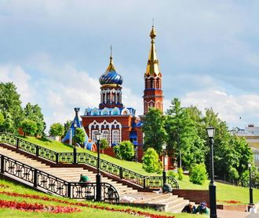
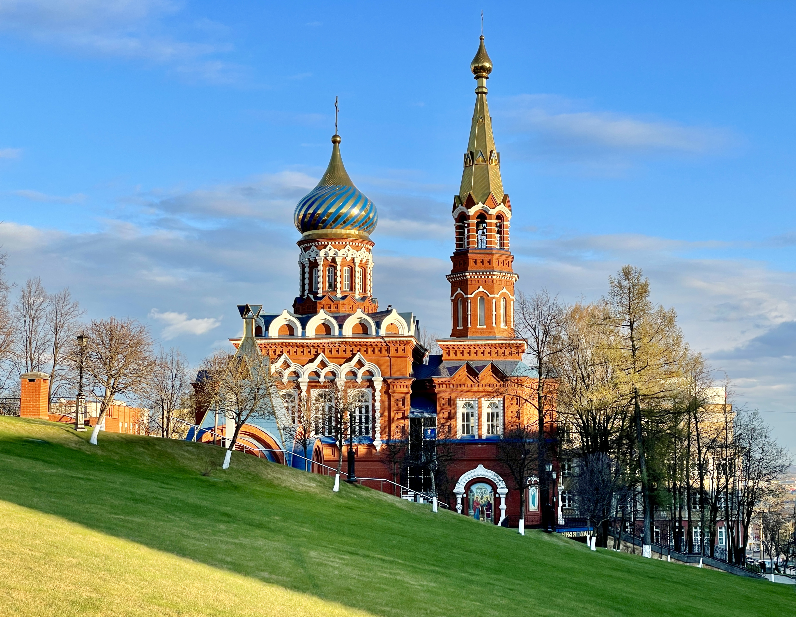
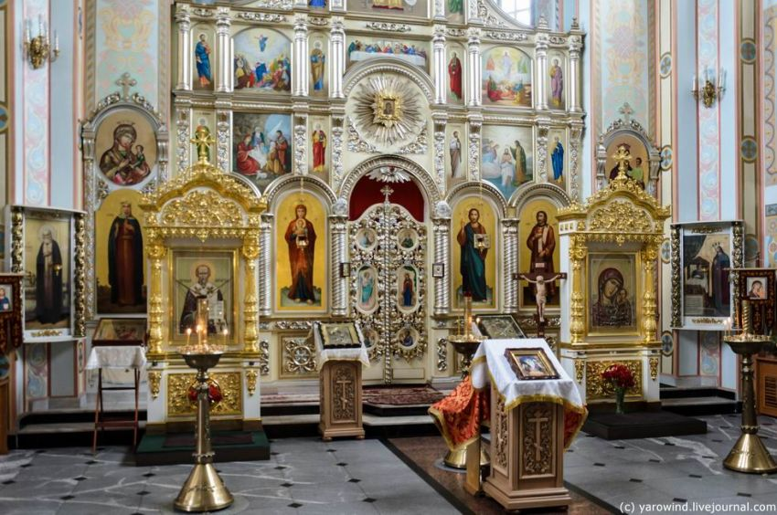

[Назад](/index.md)

### &nbsp;&nbsp;&nbsp;Храм Казанской Божьей Матери
&nbsp;&nbsp;&nbsp;&nbsp;&nbsp;Строительство храма положило начало возрождению всего комплекса Свято-Михайловского собора. Первоначально он был задуман как часовня, но уж в ходе проектирования по благословению митрополита Ижевского Николая (Шкрумко) он был увеличен до нынешних размеров. В самом начале строительства все делалось усердием верующих без налаженного финансирования и материально-технической базы.
&nbsp;&nbsp;&nbsp;&nbsp;&nbsp;Эту начальную, незаметную, но самую трудную работу взяла на себя Ольга Федоровна Зорина, в те времена работавшая директором городского Треста банно-прачечного хозяйства. Получив чудесное вразумление о необходимости восстанавливать стоявший когда–то на соседствующем с Трестом БПХ возвышении величественный собор, она обратилась к Архиепископу Николаю. Владыка Николай сказал, что это вразумление от Бога и благословил Ольгу Федоровну на это доброе дело.
&nbsp;&nbsp;&nbsp;&nbsp;&nbsp;Она добилась отвода земли под весь комплекс будущего собора, она искала пожертвования на проектирование, геологические изыскания, археологические раскопки, сама немалое время провела в архивах в поисках проектной и прочей документации по собору. Работники треста БПХ установили поклонный крест и памятные знаки на месте будущих собора и Казанско-Богородицкого храма, а закладной камень под храм она доставала из Ижевского пруда своими руками.
&nbsp;&nbsp;&nbsp;&nbsp;&nbsp;Строительство началось в 1996 году под руководством Попечительского совета, который в то время возглавлял Сергей Витальевич Чикуров. Началось оно с перенесения с места строительства коммуникаций «Ижводоканала», стоившего больших усилий и немалых денег. Эта работа также была выполнена хлопотами О.Ф. Зориной и усердием Валерия Федоровича Загайнова.
&nbsp;&nbsp;&nbsp;&nbsp;&nbsp;Разработка котлована была начата 22 мая 1997 г. в день 70-летия владыки Николая. Он благословил группу прихожан на ежедневное чтение акафиста у поклонного креста перед иконой Божией Матери «Казанская». Чтение акафиста продолжалось неукоснительно до завершения строительства Каззанско-Богородицкого храма, всего было прочитано более 1600 акафистов. По праздникам духовенство служило здесь молебны.
&nbsp;&nbsp;&nbsp;&nbsp;&nbsp;В начале ноября 1997 г. был один из самых критических моментов стройки: надвигались двадцатиградусные морозы и только что залитый фундамент мог замерзнуть. Выручили нефтяники из «Ижевскнефти». Раис Мусагитович Сулейманов прислал технику – и фундамент был спасен. На благотворительных началах работал и подрядчик – фирма «Мастер» из Воткинска. Каменщики этой фирмы из бригады Василия Васильевича Рогознева работали точно и аккуратно, как хирурги.
&nbsp;&nbsp;&nbsp;&nbsp;&nbsp;В ходе строительства изменялись и сами строители. Они приходили к вере. Один из них после первой исповеди и причастия получил исцеление от опасной болезни. В 1998- 1999г.г. на стройке был длительный простой – закончились средства у заказчика. В это время Попечительский совет, старший прораб Виктор Григорьевич Новиков и немногочисленные прихожане организовали охрану стройки от разграбления. А когда 21 июля 1998 г. затихшую стройплощадку неожиданно посетил Президент Александр Александрович Волков, прихожане восприняли это как знак заступничества Божией Матери.
&nbsp;&nbsp;&nbsp;&nbsp;&nbsp;И эти труды увенчались победой. Храм был торжественно открыт 4 ноября 2001 года. Для Ижевска это был первый опыт нового храмового строительства, ставший бесценным при возведении Свято-Михайловского собора.
&nbsp;&nbsp; 
&nbsp;&nbsp;&nbsp;&nbsp;&nbsp;Среди наиболее чтимых святынь храма – частицы мощей св. блгв. Воина Феодора (Ушакова) Санаксарского, свт. Филарета Московского и икона Божией Матери «Исцелительница».
&nbsp;&nbsp;&nbsp;&nbsp;&nbsp;&nbsp;

&nbsp;&nbsp;&nbsp;&nbsp;&nbsp;Режим работы: ежедневно с 8:00 до 19:00