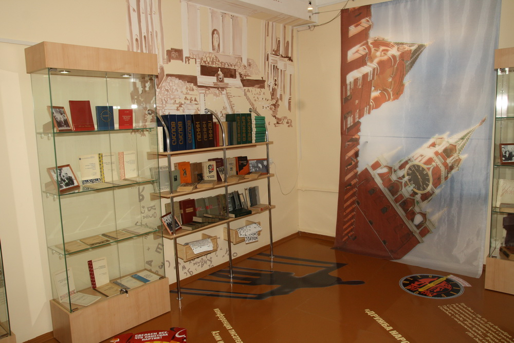
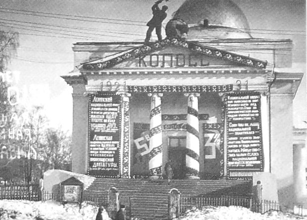
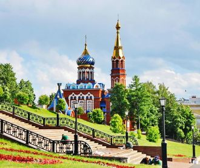

## &nbsp;&nbsp; Культурно-познавательный туризм
<button name="button" link = "kalashnikov.md" >Калашников</button>
### &nbsp;&nbsp;&nbsp;Музейно-выставочный комплекс оружия им. М.Т. Калашникова
&nbsp;&nbsp;&nbsp;&nbsp;&nbsp;4 ноября 2004 года в столице Республики Удмуртия городе Ижевске открылся музей знаменитого 
конструктора-оружейника Михаила Тимофеевича Калашникова (в 2005 году переименован в Музейно-выставочный комплекс им. М.Т.Калашникова). Экспозиция музея состоит из центрального зала, мемориально-исторической экспозиции и временных выставок, посвященных ижевскому оружейному производству.
&nbsp;&nbsp;&nbsp;&nbsp;&nbsp;&nbsp;&nbsp;&nbsp;&nbsp;&nbsp;&nbsp;&nbsp;&nbsp;&nbsp;&nbsp;&nbsp;&nbsp;&nbsp;&nbsp;&nbsp;&nbsp;&nbsp;&nbsp;&nbsp;&nbsp;&nbsp;&nbsp;&nbsp;&nbsp;&nbsp;&nbsp;&nbsp;&nbsp;&nbsp;&nbsp;&nbsp;&nbsp;&nbsp;&nbsp;&nbsp;&nbsp;&nbsp;&nbsp;&nbsp; 
 
&nbsp;&nbsp;&nbsp;&nbsp;&nbsp;Центральный зал по своей архитектуре относится к типу храмовых пространств, отсюда его торжественное звучание. Экспозиция интерпретирует оружейный мир, как мир человеческой мысли, знания, поиска. Экспозиция зала открывает посетителю истоки "Феномена Калашникова, Человека и его Изобретения". М.Т.Калашников "стоит на плечах титанов", поэтому в зале появляются образы гениев технической мысли от Архимеда и Леонардо да Винчи до русских изобретателей оружейников. Возникает галерея, в которой М.Т.Калашникову отведено достойное место. Но это лишь один из трех источников феномена Калашникова. Другой источник - русское оружейное производство, прежде всего ижевское. История Ижевского завода и заводов формирует вторую тему вводного зала. Наконец, третья тема - это тема "Защиты Отчизны". Она переходит в тему "Мироустроения, культуры мира, ценностей мира, дома и семьи", которые защищает человек. Торжественный зал, скорее "сокровищница", чем арсенал, здесь много историческог оружия, которое показывается как драгоценность.
  

&nbsp;&nbsp;&nbsp;&nbsp;&nbsp;Основная экспозиция строится вокруг биографии знаменитого конструктора-оружейника и состоит из трех разделов:
- Пространство жизни
- Пространство творчества
- Пространство славы

&nbsp;&nbsp;&nbsp;&nbsp;&nbsp;В динамической экспозиции на плазменных панелях представлены видеоматериалы - документальные фильмы об М.Т.Калашникове и хроника.
 

&nbsp;&nbsp;&nbsp;&nbsp;&nbsp;Экспозиция в целом представляет собой музейное прочтение воспоминаний М.Т.Калашникова. Все сюжетные линии сходятся в образе одного человека - героя своего времени и национального героя. Именно личность М.Т.Калашникова связывает столь различные миры как Россия, США, Китай и Ближний Восток. Расположенные по дуге экспозиционные залы как бы стремятся, в конечном счете, сомкнуться. "Пространство жизни" не только начинает, но и завершает экспозицию, символизируя возвращение человека к самому себе, к своим истокам.
&nbsp;&nbsp;&nbsp;&nbsp;&nbsp;Основная экспозиция открывается историей жизни человека. Затем появляется "второй герой", и начинается история автомата. В "Пространстве славы" жизнь человека обретает новый, мировой контекст. Имя "Калашников" становится достоянием цивилизации и начинает жить самостоятельно. В экспозиции появляется третий герой.
&nbsp;&nbsp;&nbsp;&nbsp;&nbsp;Главными средствами организации экспозиционного пространства являются 17 видео и мультимедийных программ, которые демонстрируются в информационных киосках, на плазменных панелях и проецируются на стены залов (посмотреть скриншоты). С их помощью удалось реализовать концепцию музея "от первого лица", когда сам герой рассказывает посетителю о своей жизни. Отрывки из мемуаров Калашникова и видеозаписи его рассказов чередуются с кадрами кинохроники, показывающими самого Калашникова, его изобретения и исторические события, на фоне которых разворачивалась его деятельность.
&nbsp;&nbsp;&nbsp;&nbsp;&nbsp;&nbsp;&nbsp;&nbsp;&nbsp;&nbsp;&nbsp;&nbsp;&nbsp;&nbsp;&nbsp;&nbsp;&nbsp;&nbsp;&nbsp;&nbsp;&nbsp;&nbsp;&nbsp;&nbsp;&nbsp;&nbsp;&nbsp;&nbsp;&nbsp;&nbsp;&nbsp;&nbsp;&nbsp;&nbsp;&nbsp;&nbsp;&nbsp;&nbsp;&nbsp;&nbsp;&nbsp;&nbsp;&nbsp;&nbsp;&nbsp;&nbsp;&nbsp;&nbsp;&nbsp;&nbsp;&nbsp;&nbsp;&nbsp;&nbsp;&nbsp;&nbsp;&nbsp;&nbsp;&nbsp;&nbsp;&nbsp;&nbsp;&nbsp;&nbsp;  

&nbsp;&nbsp;&nbsp;&nbsp;&nbsp;Режим работы выставочных залов и тира:
&nbsp;&nbsp;&nbsp;&nbsp;&nbsp;Пн - выходной.
&nbsp;&nbsp;&nbsp;&nbsp;&nbsp;Вт-ср, пт-вс - 11.00-19.00, касса до 18.30.
&nbsp;&nbsp;&nbsp;&nbsp;&nbsp;Чт - 11.00-21.00, касса до 20.30.

### &nbsp;&nbsp;&nbsp;Национальный музей Удмуртской Республики имени Кузебая Герда
&nbsp;&nbsp;&nbsp;&nbsp;&nbsp;История Национального музея Удмуртской Республики, в настоящий момент крупнейшего научно-исследовательского, культурно-просветительного и методического центра Удмуртской Республики, - это история становления и развития краеведения в республике.
&nbsp;&nbsp;&nbsp;&nbsp;&nbsp;Основан Исполкомом Ижевского городского Совета как Ижевский музей местного края в ноябре 1920 г. С 2000 г. - Национальный музей Удмуртской Республики имени Кузебая Герда. К. Герд (К.П. Чайников) (1898 - 1937) - выдающийся деятель удмуртской интеллигенции ХХ века, профессиональный поэт, просветитель, директор музея с 1925 по 1926 гг.
&nbsp;&nbsp;&nbsp;&nbsp;&nbsp;Экспозиция представляет собой систему выставок, дающих представление о природе и истории края, являющегося исторической прародиной финно-угорских народов. Этническая история проживающих в республике удмуртов, русских, марийцев и татар представлена в богатых коллекциях и музейных комплексах национальной одежды, утвари и других предметах, рассказывающих о жизни, обычаях и обрядах, религии народов края. Удмурты - один из немногих народов мира, сохраняющих язычество.
 
&nbsp;&nbsp;&nbsp;&nbsp;&nbsp;Удмуртия, и в частности Ижевск, известны в мире как кузница армейского, охотничьего и спортивного оружия. Экспозиции по истории Ижевского оружия и военной истории края - объект постоянного интереса российских и иностранных туристов всех возрастов.
&nbsp;&nbsp;&nbsp;&nbsp;&nbsp;Музей является победителем конкурса "Меняющийся музей в меняющемся мире" 2006 г. - проект "Гражданская эстафета", 2007 г. - проект "Музейный телеклуб межнациональных семей "Счастье в доме. ru" и 2010 г. - проект "Музеи региона: новая волна".

&nbsp;&nbsp;&nbsp;&nbsp;&nbsp;Разделы экспозиции:
- «Память веков» 
Древняя и средневековая история края VIII тыс. до н.э. – XV в. Происхождение удмуртского этноса.
- «Мы - удмурты».
Экспозиция раскрывает картину мира удмуртов XVI—XX вв. В воссозданной деревне можно познакомиться с культурой и бытом местных жителей, их ремеслами и верованиями, выраженными в связи человека с природой.
&nbsp;&nbsp;&nbsp;&nbsp;&nbsp;&nbsp;&nbsp;&nbsp;&nbsp;&nbsp;&nbsp;&nbsp;&nbsp;&nbsp;&nbsp;&nbsp;&nbsp;&nbsp;&nbsp;&nbsp;&nbsp;&nbsp;&nbsp;&nbsp; &nbsp;&nbsp; &nbsp;&nbsp; 
- «А торг – дело великое».
Этот зал музея «Арсенал» Ижевска посвящен ярмаркам XIX–XX веков. Посетителям предлагается посмотреть на местный фотосалон и сделать памятную фотографию.
- «Города начинались с заводов».
Заводы представлены как важные факторы в развитии края и его культурной жизни. Здесь оформлены заводские цеха с выпускаемой продукцией, можно увидеть фотографии, документы, афиши тех лет. В зале также воссоздана обстановка различных городских мест и учреждений: начальной школы, больницы, сада, цирка и театра.
&nbsp;&nbsp;&nbsp;&nbsp;&nbsp;&nbsp;&nbsp;&nbsp;&nbsp;&nbsp;&nbsp;&nbsp;&nbsp;&nbsp;&nbsp;&nbsp;&nbsp;&nbsp;&nbsp;&nbsp;&nbsp;&nbsp;&nbsp;&nbsp; &nbsp;&nbsp; &nbsp;&nbsp; 
- «Геннадий Красильников. Выбор пути» 
 Экспозиция поднимает современные вопросы как частной, так и общеэтнической судьбы. Один из них: как усвоить чужую культуру, не изменив своей. Впервые в экспозиции представлены документы личной переписки, романтические фотографии студенческой поры, уникальные свидетельства напряжённой внутренней жизни писателя. В течение сорока минут вы сможете побывать в трёх географических точках, оказавших влияние на всю дальнейшую жизнь писателя и, совершив собственный выбор, почувствовать атмосферу далёких 50-х, незабываемых 60-х и удушающих 70-х гг. ХХ века.
 &nbsp;&nbsp; &nbsp;&nbsp; &nbsp;&nbsp; 

&nbsp;&nbsp;&nbsp;&nbsp;&nbsp;Постоянные экспозиции: 
- «Природа Удмуртии».
Посетители узнают о животных и растениях, которых можно было увидеть на территории республики много тысяч лет назад. На стене представлены следы различных древних обитателей. В зале также выставлены чучела зверей из местных лесов, оформлен стенд о городских обитателях. Для детей приготовлены различные игры.
&nbsp;&nbsp; &nbsp;&nbsp; &nbsp;&nbsp; 
- «История и культура края VIII тыс. до н.э.-нач. XX в».
Здесь экспонируются результаты археологических раскопок на территории республики. Они повествуют об истории края с VIII века до н. э. по XХ век н. э.: где проживали люди, как обустраивали свои жилища, чем занимались, какие проводили обряды.
&nbsp;&nbsp; &nbsp;&nbsp; &nbsp;&nbsp; 
&nbsp;&nbsp;&nbsp;&nbsp;&nbsp;Стоимость входных билетов зависит от осматриваемого зала:
&nbsp;&nbsp;&nbsp;&nbsp;&nbsp;«Историческая экспозиция»: взрослые — 180 руб., студенты — 90 руб., пенсионеры — 80 руб., школьники — 60 руб., дети 3–7 лет — 40 руб.
&nbsp;&nbsp;&nbsp;&nbsp;&nbsp;«Природа Удмуртии»: взрослые — 190 руб., студенты — 110 руб., пенсионеры — 100 руб., школьники — 70 руб., дети 3–7 лет — 50 руб.
&nbsp;&nbsp;&nbsp;&nbsp;&nbsp;Временные выставки: взрослые — 120 руб., студенты, пенсионеры и школьники — 60 руб., дети 3–7 лет — 40 руб.
&nbsp;&nbsp;&nbsp;&nbsp;&nbsp;Режим работы: 
&nbsp;&nbsp;&nbsp;&nbsp;&nbsp;Пн — выходной.
&nbsp;&nbsp;&nbsp;&nbsp;&nbsp;Вт-Вс: 10:00 — 18:00.
&nbsp;&nbsp;&nbsp;&nbsp;&nbsp;Чт: 13:00 — 21:00.

### &nbsp;&nbsp;&nbsp;Выставочный центр «Галерея»
&nbsp;&nbsp;&nbsp;&nbsp;&nbsp;Выставочный центр «Галерея» - одна из самых крупных выставочных площадок в столице Удмуртии. Открыта в 1993 г. на Центральной площади Ижевска. В настоящее время здесь одновременно работают три выставочных зала.
&nbsp;&nbsp;&nbsp;&nbsp;&nbsp;Основная цель «Галереи» — организация художественных проектов, призванных знакомить ижевчан и гостей города с разными видами и направлениями изобразительного искусства. Приоритетная задача — поддержка и продвижение творчества художников Удмуртии. В течение года «Галерея» организует более 30 выставок.
&nbsp;&nbsp;&nbsp;&nbsp;&nbsp;«Галерея» принимает активное участие в городских и республиканских культурных проектах. На сегодняшний день центр широко представлен в информационном поле города и республики. Ежегодно «Галерею» посещает более 70 тысяч человек.
&nbsp;&nbsp;&nbsp;&nbsp;&nbsp;&nbsp;&nbsp;&nbsp;&nbsp;&nbsp;&nbsp;&nbsp;&nbsp;&nbsp;&nbsp;&nbsp;&nbsp;&nbsp;&nbsp;&nbsp;&nbsp;&nbsp;&nbsp;&nbsp;&nbsp;&nbsp;&nbsp;&nbsp;&nbsp;&nbsp;&nbsp;&nbsp;&nbsp;&nbsp;&nbsp;&nbsp;&nbsp;&nbsp;&nbsp;&nbsp;&nbsp;&nbsp;&nbsp;&nbsp;&nbsp;

&nbsp;&nbsp;&nbsp;&nbsp;&nbsp;Выставочные залы:
&nbsp;&nbsp;&nbsp;&nbsp;&nbsp;Большой зал – здесь проходят масштабные проекты, организованные в партнерстве с российскими музеями, галереями, творческими союзами, частными коллекционерами и художниками. Данные выставки становятся значимыми событиями в культурной жизни города и республики.
&nbsp;&nbsp;&nbsp;&nbsp;&nbsp;Малый зал предназначен для выставок камерного характера. В нём проводятся выставки самой разной направленности и тематики: от персональных выставок до коллективных проектов.
&nbsp;&nbsp;&nbsp;&nbsp;&nbsp;Открытый зал – территория свободного посещения и экспериментального творчества. Молодая выставочная площадка, дающая возможность заявить о себе творческим людям города и республики.
&nbsp;&nbsp; &nbsp;&nbsp; 

&nbsp;&nbsp;&nbsp;&nbsp;&nbsp;Билет по цене входа на выставку: 200 руб. – взрослый. 150 руб. – детский.

&nbsp;&nbsp;&nbsp;&nbsp;&nbsp;Режим работы:  
&nbsp;&nbsp;&nbsp;&nbsp;&nbsp;ПН – выходной.
&nbsp;&nbsp;&nbsp;&nbsp;&nbsp;Вт-вс с 10:00 до 20:00.

### &nbsp;&nbsp;&nbsp;Государственный театр оперы и балета Удмуртской Республики
&nbsp;&nbsp;&nbsp;&nbsp;&nbsp;Организованный в 1993 году Государственный театр оперы и балета Удмуртской Республики – это культурный центр республики, являющейся родиной П.И.Чайковского. Первым, подготовительным этапом к его созданию оказалось открытие в 1931 году Удмуртского драматического театра, при котором в 1934-35 годах функционировала оперная труппа. Она состояла из приехавших солистов ГАБТа и Московского областного оперного театра Г.Ф.Землякова, К.Н.Рушева, А.А.Рыбакова, С.К.Шехова, С.А.Штурбина, С.И.Феофилова, И.И.Якушина. Дирижёром театрального оркестра из 30 человек, укомплектованного редкими для Удмуртии того времени инструментами – гобоем, фаготом, литаврами – был композитор Д.С.Васильев-Буглай (1886-1956). Он же собрал для театра хор из 40 человек.

&nbsp;&nbsp;&nbsp;&nbsp;&nbsp;Государственный театр оперы и балета Удмуртской Республики знакомит зрителя с шедеврами мировой оперной и балетной классики. Его репертуар сопоставим с репертуарами театров крупных региональных центров. Он включает оперы В. Беллини, Ж. Бизе, Д. Верди, Г. Доницетти, П. Масканьи, Дж. Пуччини, Дж. Россини.
&nbsp;&nbsp;&nbsp;&nbsp;&nbsp;Репертуар балетной труппы позволяет зрителю составить полное представление о тенденциях развития балетного жанра, так как включает и классику («Жизель» Ш. Адана, «Пахита» и «Дон Кихот» Л. Минкуса), и разновидности балета-драмы («Кармен-сюита» Бизе-Щедрина). Также в репертуар входят оперетты, музыкальные комедии и мюзиклы.
&nbsp;&nbsp; 
&nbsp;&nbsp;&nbsp;&nbsp;&nbsp;Наряду с крупными сценическими формами, театр предлагает публике разнообразные концертные программы и ведёт большую работу с детьми, молодёжью. Школьникам ежегодно адресованы спектакли и композиции самой разной тематики.
&nbsp;&nbsp;&nbsp;&nbsp;&nbsp;Зрительный зал рассчитан на 830 мест. В театре имеется актерское кафе, бар, большой банкетный зал на 600 мест, танцпол, VIP-комната для приемов.
&nbsp;&nbsp; 
&nbsp;&nbsp;&nbsp;&nbsp;&nbsp;[Афиша Государственного театра оперы и балета УР](http://operaizh.ru/actionlist.php)
### &nbsp;&nbsp;&nbsp;Государственный Русский драматический театр Удмуртии
&nbsp;&nbsp;&nbsp;&nbsp;&nbsp;Государственный русский драматический театр Удмуртии  был открыт в  Ижевске в 1935 году. Основанный на родине великого композитора Чайковского, театр развивает и продолжает лучшие традиции русского искусства. Высокохудожественный репертуар, профессиональная стабильная труппа, в составе которой много крупных мастеров сцены,  оригинальная  режиссура, жанровое разнообразие постановок - все это делает театр привлекательным и интересным для  самых широких слоев  публики. С 2011 года коллектив работает в новом современном здании,  где созданы все условия для творчества артистов и  комфортного пребывания  зрителей.
&nbsp;&nbsp; &nbsp;&nbsp; 
&nbsp;&nbsp;&nbsp;&nbsp;&nbsp;Театр активно ведет поиски новых средств выразительности, успешно сотрудничая как с местными, так и с приглашенными творческими деятелями. Постановки осуществляют ведущие  режиссеры и сценографы, признанные творческие мастера России и зарубежья. Спектакли театра неоднократно становились участниками и лауреатами российских и международных фестивалей. Так спектакль «Человек-подушка» стал лауреатом Первого международного фестиваля Мартина МакДонаха (Пермь, 2014). Спектакль «Маленькие трагедии» по произведениям Александра Пушкина стал лауреатом и одним из самых обсуждаемых спектаклей фестивальной программы  XXII Международного пушкинского театрального фестиваля, (Псков, 2015). Дважды наш коллектив представлял свои спектакли в конкурсной программе Российского национальной театрального фестиваля «Золотая Маска» («Маленькие трагедии» в 2016, «Король Лир» в 2019). Театр ведет активную гастрольную деятельность, с неизменным успехом выступая в таких крупных театральных городах, как Пермь, Уфа, Казань, Нижний Новгород, Тюмень, Челябинск и других.
&nbsp;&nbsp; 
&nbsp;&nbsp;&nbsp;&nbsp;&nbsp;[Афиша Государственного Русского драматического театра Удмуртии](https://dramteatr18.ru/affiche/)

## &nbsp;&nbsp;Религиозный туризм
### &nbsp;&nbsp;&nbsp;Михайло-Архангельский кафедральный собор
&nbsp;&nbsp;&nbsp;&nbsp;&nbsp;В первой половине XIX века среди ижевчан возникло особое почитание Архангела Михаила — святого покровителя генерал-фельдцейхмейстера великого князя Михаила Павловича — начальника всех оружейных заводов России; перед Александро-Невским собором города (1823) был построен и освящён памятник последнему.
&nbsp;&nbsp;&nbsp;&nbsp;&nbsp;В 1855 году на месте прежней Троицкой церкви выстроена в византийском стиле большая каменная часовня 30-метровой высоты — в честь Архангела Михаила. В 1876 году началась кампания по сбору средств на строительство на месте Михайловской часовни нового храма. В 1893 рабочие Ижевского завода приняли решение перечислять на строительство храма 1% от зарплаты. Проектирование было поручено вятскому архитектору Ивану Чарушину, который выполнил проект за 3 года и 5850 рублей. Строительный комитет в 1896 году принял решение о том, что новый сбор не должен быть больше Александро-Невского собора. В 1897 году состоялась торжественная закладка собора на Нагорной площади, основное строительство здания было завершено к 1907 году, главный престол был освящён 4 ноября того же года во имя Святого Архистратига Михаила. Из-за революционных событий дальнейшее благоустройство храма было приостановлено. 4 ноября 1915 состоялось торжественное освящение главного престола храма как бесприходной церкви Ижевского завода, приписанной к Александро-Невскому собору. Самостоятельный приход был открыт в 1917 году. Храм имел 3 престола: главный — во имя Архистратига Михаила, южный — в честь Николая Чудотворца и северный — в честь мученицы Александры.
&nbsp;&nbsp; 
&nbsp;&nbsp;&nbsp;&nbsp;&nbsp;В 1922 году по проекту архитектора Г. Ф. Сенатова рядом с храмом был построен Революционный некрополь бойцов Красной Армии, погибших при освобождении Ижевска от белогвардейцев во время Гражданской войны. Некрополь входил в число памятников культуры и истории, охраняемых государством. После разборки здания собора в 1937 году на месте рядом с монументом расположился липовый сквер, который в советское время был местом отдыха ижевчан.
&nbsp;&nbsp;&nbsp;&nbsp;&nbsp;19 марта 1929 года Ижевский городской совет рабочих и красноармейских депутатов постановил: «Расторгнуть договоры с религиозными общинами Михайловского, Александро-Невского соборов и Покровской церкви на аренду зданий». 26 марта 1929 года собор был закрыт и опечатан представителями ижевской милиции. С 1932 по 1937 годы в здании собора располагался Областной музей краеведения ВАО. 8 апреля 1937 года СНК УАССР принял решение о сносе здания Михайловского собора (постановление было подписано 14—15 апреля 1937 года), и вскоре собор был разрушен.
&nbsp;&nbsp;&nbsp;&nbsp;&nbsp;11 февраля 2000 года было принято совместное постановление Президиума Государственного Совета Удмуртской Республики и Правительства Удмуртской Республики, положившее начало воссозданию Свято-Михайловского собора. В мае 2004 года состоялось закладка в основание будущего собора освященного креста. Архитектор воссоздания Е. Л. Скопин.
&nbsp;&nbsp;&nbsp;&nbsp;&nbsp;16 мая 2007 года, в отдание праздника Пасхи, митрополит Ижевский и Удмуртский Николай (Шкрумко) совершил освящение нижнего храма в честь Веры, Надежды, Любови и матери их Софии.
&nbsp;&nbsp;&nbsp;&nbsp;&nbsp;5 августа 2007 года главный престол, посвящённый Архистратигу Михаилу, был освящён Патриархом Алексием II, который совершил первую литургию в храме в присутствии президента Удмуртии Александра Волкова и иных официальных лиц.
&nbsp;&nbsp;&nbsp;&nbsp;&nbsp;В июле 2017 года Михайловскому собору присвоен статус кафедрального храма Ижевской и Удмуртской епархии.
&nbsp;&nbsp;&nbsp;&nbsp;&nbsp;В феврале 2007 года во время строительных работ по восстановлению собора строительная техника сломала кованую ограду вокруг монумента, разрушила лестницу, ведущую к нему, площадку перед стелой и оба крыла памятника. На площадке перед памятником прошёл митинг против сноса монумента, организованный Ижевским комитетом РКРП и региональным отделением партии «Патриоты России». После этого было объявлено, что частичное разрушение памятника является частью работ по реконструкции памятника, чтобы вписать некрополь в архитектурный ансамбль собора. Площадка перед монументом к моменту открытия собора была отреставрирована. Тем не менее, реставрация существенно изменила облик некрополя, задуманный архитектором: так, памятник лишился чугунной ограды и двух крыльев, а лестница была уменьшена и переориентирована на север.
&nbsp;&nbsp; &nbsp;&nbsp; 

&nbsp;&nbsp;&nbsp;&nbsp;&nbsp;Время работы собора: ежедневно с 7:00 до 19:30

### &nbsp;&nbsp;&nbsp;Александро-Невский кафедральный собор
&nbsp;&nbsp;&nbsp;&nbsp;&nbsp;В результате пожара 1810 года были уничтожены значительная часть города и главный в то время храм — церковь Ильи Пророка, встал вопрос о строительстве нового храма. Уже на следующий год заводской архитектор С. Е. Дудин, выполнил проект монументального собора с тремя престолами и тремя колокольнями, но проект был отвергнут, в связи с излишней пышностью и дороговизной. Взамен отвергнутого проекта петербургские власти рекомендовали взять в качестве образца проект Андреевского собора в Кронштадте. Дудин откорректировал чертежи, исходя из местных условий, например, заменил гранит на заводское литье, а также упростил отдельные архитектурные формы.
&nbsp;&nbsp;&nbsp;&nbsp;&nbsp;Строительство завершилось в 1823 году. Центральный придел был освящен в честь святого благоверного князя Александра Невского, южный предел — в честь святой великомученицы Екатерины, северный — в честь Казанской иконы Божией Матери, нижний, «пещерный» храм — в честь святых мучеников Власия и Модеста.
&nbsp;&nbsp;&nbsp;&nbsp;&nbsp;&nbsp;&nbsp;&nbsp;&nbsp;&nbsp;&nbsp;&nbsp;&nbsp;&nbsp;&nbsp;&nbsp;&nbsp;&nbsp;&nbsp;&nbsp;&nbsp;&nbsp;&nbsp;&nbsp;&nbsp;&nbsp;&nbsp;&nbsp;&nbsp;&nbsp;&nbsp;&nbsp;&nbsp;&nbsp;&nbsp;&nbsp;&nbsp;&nbsp;&nbsp;&nbsp;&nbsp;&nbsp;&nbsp;&nbsp;&nbsp;&nbsp;&nbsp;&nbsp;&nbsp;&nbsp;&nbsp;&nbsp;&nbsp;&nbsp;&nbsp;&nbsp;&nbsp;&nbsp;&nbsp;&nbsp;&nbsp;&nbsp;&nbsp;&nbsp;
&nbsp;&nbsp;&nbsp;&nbsp;&nbsp;В 1824, проезжая через Ижевск, собор посетил император Александр I. В 1871 году при Соборе открылось попечительство, которое занималось просветительской благотворительной работой. С 1875 года при храме действовала воскресная школа. Позднее при соборе образованы и другие школы, благотворительные комиссии и общество трезвости.
&nbsp;&nbsp;&nbsp;&nbsp;&nbsp;В 1929 году собор был закрыт по требованию юношеской секции Союза воинствующих безбожников, и в том же году разрушили колокольню и переоборудовали собор под клуб. С 1930 года здание собора служило как детский клуб и кинотеатр, позднее как музей атеизма. В 1932 году, после новой реконструкции, в здании бывшего собора открылся кинотеатр «Колосс». В 1937 году был разобран купол храма, после этого изуродованное здание было причислено к «памятникам архитектуры I категории».
&nbsp;&nbsp;&nbsp;&nbsp;&nbsp;&nbsp;&nbsp;&nbsp;&nbsp;&nbsp;&nbsp;&nbsp;&nbsp;&nbsp;&nbsp;&nbsp;&nbsp;&nbsp;&nbsp;&nbsp;&nbsp;&nbsp;&nbsp;&nbsp;&nbsp;&nbsp;&nbsp;&nbsp;&nbsp;&nbsp;&nbsp;&nbsp;&nbsp;&nbsp;
&nbsp;&nbsp;&nbsp;&nbsp;&nbsp;Собор был возвращен верующим в 1990 году и после подготовки проекта реставрации в 1992 году начались работы по возрождению собора. К концу 1993 года ремонт был завершён, на территории собора построены новый крестильный храм, иордань для освящения воды, звонница и 2 января 1994 года состоялось освящение собора. 
&nbsp;&nbsp; &nbsp;&nbsp; 

&nbsp;&nbsp;&nbsp;&nbsp;&nbsp;Время работы собора: пн-сб с 7:00 до 19:00, вс с 6:30 до 18:00

### &nbsp;&nbsp;&nbsp;Храм Казанской Божьей Матери
&nbsp;&nbsp;&nbsp;&nbsp;&nbsp;Строительство храма положило начало возрождению всего комплекса Свято-Михайловского собора. Первоначально он был задуман как часовня, но уж в ходе проектирования по благословению митрополита Ижевского Николая (Шкрумко) он был увеличен до нынешних размеров. В самом начале строительства все делалось усердием верующих без налаженного финансирования и материально-технической базы.
&nbsp;&nbsp;&nbsp;&nbsp;&nbsp;Эту начальную, незаметную, но самую трудную работу взяла на себя Ольга Федоровна Зорина, в те времена работавшая директором городского Треста банно-прачечного хозяйства. Получив чудесное вразумление о необходимости восстанавливать стоявший когда–то на соседствующем с Трестом БПХ возвышении величественный собор, она обратилась к Архиепископу Николаю. Владыка Николай сказал, что это вразумление от Бога и благословил Ольгу Федоровну на это доброе дело.
&nbsp;&nbsp;&nbsp;&nbsp;&nbsp;Она добилась отвода земли под весь комплекс будущего собора, она искала пожертвования на проектирование, геологические изыскания, археологические раскопки, сама немалое время провела в архивах в поисках проектной и прочей документации по собору. Работники треста БПХ установили поклонный крест и памятные знаки на месте будущих собора и Казанско-Богородицкого храма, а закладной камень под храм она доставала из Ижевского пруда своими руками.
&nbsp;&nbsp;&nbsp;&nbsp;&nbsp;Строительство началось в 1996 году под руководством Попечительского совета, который в то время возглавлял Сергей Витальевич Чикуров. Началось оно с перенесения с места строительства коммуникаций «Ижводоканала», стоившего больших усилий и немалых денег. Эта работа также была выполнена хлопотами О.Ф. Зориной и усердием Валерия Федоровича Загайнова.
&nbsp;&nbsp;&nbsp;&nbsp;&nbsp;Разработка котлована была начата 22 мая 1997 г. в день 70-летия владыки Николая. Он благословил группу прихожан на ежедневное чтение акафиста у поклонного креста перед иконой Божией Матери «Казанская». Чтение акафиста продолжалось неукоснительно до завершения строительства Каззанско-Богородицкого храма, всего было прочитано более 1600 акафистов. По праздникам духовенство служило здесь молебны.
&nbsp;&nbsp;&nbsp;&nbsp;&nbsp;В начале ноября 1997 г. был один из самых критических моментов стройки: надвигались двадцатиградусные морозы и только что залитый фундамент мог замерзнуть. Выручили нефтяники из «Ижевскнефти». Раис Мусагитович Сулейманов прислал технику – и фундамент был спасен. На благотворительных началах работал и подрядчик – фирма «Мастер» из Воткинска. Каменщики этой фирмы из бригады Василия Васильевича Рогознева работали точно и аккуратно, как хирурги.
&nbsp;&nbsp;&nbsp;&nbsp;&nbsp;В ходе строительства изменялись и сами строители. Они приходили к вере. Один из них после первой исповеди и причастия получил исцеление от опасной болезни. В 1998- 1999г.г. на стройке был длительный простой – закончились средства у заказчика. В это время Попечительский совет, старший прораб Виктор Григорьевич Новиков и немногочисленные прихожане организовали охрану стройки от разграбления. А когда 21 июля 1998 г. затихшую стройплощадку неожиданно посетил Президент Александр Александрович Волков, прихожане восприняли это как знак заступничества Божией Матери.
&nbsp;&nbsp;&nbsp;&nbsp;&nbsp;И эти труды увенчались победой. Храм был торжественно открыт 4 ноября 2001 года. Для Ижевска это был первый опыт нового храмового строительства, ставший бесценным при возведении Свято-Михайловского собора.
&nbsp;&nbsp; 
&nbsp;&nbsp;&nbsp;&nbsp;&nbsp;Среди наиболее чтимых святынь храма – частицы мощей св. блгв. Воина Феодора (Ушакова) Санаксарского, свт. Филарета Московского и икона Божией Матери «Исцелительница».
&nbsp;&nbsp;&nbsp;&nbsp;&nbsp;&nbsp;

&nbsp;&nbsp;&nbsp;&nbsp;&nbsp;Режим работы: ежедневно с 8:00 до 19:00

### &nbsp;&nbsp;&nbsp;Свято-Троицкий собор
&nbsp;&nbsp;&nbsp;&nbsp;&nbsp;Первое упоминание о Троицкой церкви в архивных документах относится к 20 марта 1782 года. Именно тогда епископ Вятский и Великопермский Лаврентий благословил преобразовать кладбищенскую часовню, стоявшую на территории современного Михайловского собора, в Троицкую церковь. День подписания храмозданной грамоты — 20 марта — можно считать первым днем рождения храма. В 1784 году построили новое деревянное здание церкви. А в 1810 году случился большой пожар, уничтоживший многие строения в нагорной части заводского поселка. Сгорела и кладбищенская церковь.
&nbsp;&nbsp;&nbsp;&nbsp;&nbsp;После пожара заводское кладбище перенесли за восточную границу поселка. Это место в те времена считалось очень отдаленным — на расстоянии нескольких сотен метров от нового кладбища находилась уже другая деревня.
&nbsp;&nbsp;&nbsp;&nbsp;&nbsp;В 1814 году по проекту архитектора Семена Емельяновича Дудина за счет казны выстроили каменный кладбищенский храм в классическом стиле и в ноябре того же года освятили его во имя Святой Троицы.
&nbsp;&nbsp; 
&nbsp;&nbsp;&nbsp;&nbsp;&nbsp;Свято-Троицкий собор — один из старейших соборов Ижевска и всей Ижевской и Удмуртской епархии. В 2014 году, в ноябре, ему исполнилось 200 лет; вернее, 200 лет исполнилось каменному храму, престол которого 2 ноября 1814 года был освящен протоиереем Захарием Лятушевичем. Сама же Троицкая деревянная часовня, сгоревшая во время знаменитого Ижевского пожара, была выстроена намного раньше.
&nbsp;&nbsp;&nbsp;&nbsp;&nbsp;На сегодняшний день при Соборе действует православное сестричество во имя иконы Божией Матери "Всецарица", где совершенно бескорыстно, во славу Божию, несут послушание 24 сестры милосердия и 30 добровольцев в городской больнице № 9. В этой больнице оборудована и освящена молитвенная комната, где каждый день сестрами читаются для пациентов утренние и вечерние молитвы и дважды в месяц служатся молебны. 
&nbsp;&nbsp;&nbsp;&nbsp;&nbsp;Кроме городской больницы № 9, приход собора  окормляет Республиканский реабилитационный центр для детей и подростков с ограниченными возможностями. В центре регулярно читаются молитвы и акафисты, ежемесячно совершается молебен. Дети, проходящие реабилитацию в центре, а также их родители ежемесячно приезжают в собор, где духовенством собора проводятся экскурсии по храму. В великие праздники, силами учащихся воскресной школы, сестер и прихожан для детей организуются праздники.
&nbsp;&nbsp;&nbsp;&nbsp;&nbsp;В осенне-зимний период силами прихода и сестричества осуществляется ежедневная раздача горячих обедов и теплых вещей бездомным людям. В день в собор приходят до 30 человек.
&nbsp;&nbsp;&nbsp;&nbsp;&nbsp;Также при Соборе действует  детская воскресная учебно-воспитательная группа , где обучается 96 детей. В 2014 году обустроена игровая детская комната, для детей, которых родители привели на Божественную Литургию для принятия Святых Христовых Таин, и где дети смогут провести время под присмотром взрослого. Комната оборудована детской мебелью и игрушками.
&nbsp;&nbsp;&nbsp;&nbsp;&nbsp;&nbsp;&nbsp;&nbsp;&nbsp;&nbsp;&nbsp;&nbsp;&nbsp;&nbsp;&nbsp;&nbsp;&nbsp;&nbsp;&nbsp;&nbsp;&nbsp;&nbsp;&nbsp;&nbsp; 

&nbsp;&nbsp;&nbsp;&nbsp;&nbsp;Режим работы: ежедневно с 07:30 до 18:00

## &nbsp;&nbsp;Спортивный туризм
### &nbsp;&nbsp;&nbsp;Учреждение культуры и спорта Ледовый дворец «Ижсталь»
&nbsp;&nbsp;&nbsp;&nbsp;&nbsp;Учреждение культуры и спорта Ледовый дворец «Ижсталь» — крытое спортивное сооружение, расположенное в городе Ижевске на улице Удмуртской.
&nbsp;&nbsp;&nbsp;&nbsp;&nbsp;На протяжении многих лет существования поселка при Ижевском заводе единственным кладбищем будущего города оставалось Троицкое. По словам историков, там было захоронено около 140 тысяч жителей поселка, в том числе - начальники завода, генералы, оружейники, а также знаменитый Семен Дудин, первый зодчий нашего города. В 1930 году кладбище было закрыто, а в 1950 его отдали под застройку.
&nbsp;&nbsp; 
&nbsp;&nbsp;&nbsp;&nbsp;&nbsp;Сейчас на территории бывшего кладбища стоит не только ледовый дворец «Ижсталь», но и стадион «Зенит», бассейн «Динамо» и другие сооружения. Единственное свидетельство о кладбище находится во дворе сохранившегося кладбищенского Свято-Троицкого собора - небольшая ротонда с памятной доской.
&nbsp;&nbsp;&nbsp;&nbsp;&nbsp;Некоторые ижевчане помнят, как при строительстве этих объектов находили останки похороненных на Троицком кладбище. Литератор Сергей Жилин в одной из своих статей пишет: «Я сам в толпе любопытствующих пацанов частенько бывал на строительстве Ледового дворца, видел черепа и истлевшие гробы тех, кто жил в этом городе задолго до меня».
&nbsp;&nbsp;&nbsp;&nbsp;&nbsp;&nbsp;&nbsp;&nbsp;&nbsp;&nbsp;&nbsp;&nbsp;&nbsp;&nbsp;&nbsp;&nbsp;&nbsp;&nbsp;&nbsp;&nbsp;&nbsp;&nbsp;&nbsp;&nbsp;&nbsp;&nbsp;&nbsp;&nbsp;&nbsp;&nbsp;&nbsp;&nbsp;&nbsp;&nbsp;&nbsp;&nbsp;&nbsp;&nbsp;&nbsp;&nbsp;&nbsp;&nbsp;&nbsp;&nbsp;&nbsp;&nbsp;&nbsp;&nbsp;&nbsp;&nbsp;
&nbsp;&nbsp;&nbsp;&nbsp;&nbsp;В настоящее время в ледовом дворце базируется СДЮСШОР «Ижсталь». Проводятся концерты, ледовые шоу, выставки и иные культурные мероприятия. Также в  «Ижстали» действуют массажный и процедурный кабинеты, спортивный и тренажёрный залы, бассейн, баня, сауна. Работают залы русского и американского бильярда, танцевальный зал, кафе, пресс-центр, экспозиция, посвященная истории дворца и хоккейного клуба, спортивный зал, имеются профессиональные теннисные столы. Под сводами арены имеется киоск, где продается форма и атрибутика клуба, эксклюзивные подарочные товары.
&nbsp;&nbsp;&nbsp;&nbsp;&nbsp;Общая площадь ледового дворца: 11 056 кв. м.
&nbsp;&nbsp;&nbsp;&nbsp;&nbsp;Число мест: 3 800. Для сравнения, республиканский цирк вмещает 1 800 зрителей.
&nbsp;&nbsp;&nbsp;&nbsp;&nbsp;Температура воздуха в зале: около +19° С (осенью и весной, когда на улице еще холодно, а отопление еще не дали, фойе и зал дворца остывают до +14° С). Лед на арене не тает за счет работы холодильных установок.
&nbsp;&nbsp;&nbsp;&nbsp;&nbsp;Лед занят ежедневно с 6:00 до 23:00. Час отводится на тренировку команды, 15 минут - на обновление льда. Сейчас в Ледовом тренируются игроки ХК «Ижсталь» и других клубов, спортсмены Детской спортивной школы хоккея, любительские команды, по воскресеньям проходят катания для всех желающих.
&nbsp;&nbsp; 

### &nbsp;&nbsp;&nbsp;Центральный Республиканский стадион «Зенит»
&nbsp;&nbsp;&nbsp;&nbsp;&nbsp;Центральный республиканский стадион «Зенит» — стадион в городе Ижевск, Республика Удмуртия. Является главным и крупнейшим стадионом республики с вместимостью — 16 000 зрителей.
&nbsp;&nbsp;&nbsp;&nbsp;&nbsp;Предшественник современного «Зенита» — тоже стадион «Зенит», ещё деревянный, строительство которого началось в 1924 году на Карлутской площади. Его открыли 12 июля 1933 года. Деревянные трибуны стадиона вмещали 3000 зрителей.
&nbsp;&nbsp;&nbsp;&nbsp;&nbsp;&nbsp;&nbsp;&nbsp;&nbsp;&nbsp;&nbsp;&nbsp;&nbsp;&nbsp;&nbsp;&nbsp;&nbsp;&nbsp;&nbsp;&nbsp;&nbsp;&nbsp;&nbsp;&nbsp;&nbsp;&nbsp;&nbsp;&nbsp;&nbsp;&nbsp;&nbsp;&nbsp;
&nbsp;&nbsp;&nbsp;&nbsp;&nbsp;О строительстве нового сооружения впервые заговорили ещё в конце 30-х годов. Но реализации планов помешала война.
&nbsp;&nbsp;&nbsp;&nbsp;&nbsp;В начале 1950-х был определён участок под стадион — территория площадью около 10 гектаров между улицами Удмуртская, Советская и Красногеройская, недалеко от действовавшего с начала 30-х стадиона «Зенит». В 1952 году Комитет содействия строительству стадионов опубликовал в республиканской прессе ряд материалов, нацеленных на то, чтобы склонить общественное мнение в пользу сооружения объекта. Это было не так просто. У стройки нашлась масса противников — стадион должен был появиться на месте старого городского кладбища. Мощным препятствием стал ещё один фактор, наличие которого в те годы замалчивалось — Ижевск, как центр оборонной промышленности, являлся закрытым для посторонних городом. Надеяться на то, что на ижевском стадионе станут проводить крупные соревнования с приездом гостей хотя бы из республик СССР, не говоря уже о других странах, не приходилось. А для городских соревнований большой стадион, как тогда считалось, был не нужен.
&nbsp;&nbsp;&nbsp;&nbsp;&nbsp;&nbsp;&nbsp;&nbsp;&nbsp;&nbsp;&nbsp;&nbsp;&nbsp;&nbsp;&nbsp;&nbsp;&nbsp;&nbsp;&nbsp;&nbsp;&nbsp;&nbsp;&nbsp;&nbsp;&nbsp;&nbsp;&nbsp;&nbsp;&nbsp;&nbsp;&nbsp;&nbsp;&nbsp;&nbsp;&nbsp;&nbsp;&nbsp;&nbsp;&nbsp;&nbsp;&nbsp;&nbsp;&nbsp;&nbsp;&nbsp;&nbsp;&nbsp;&nbsp;&nbsp;&nbsp;&nbsp;&nbsp;&nbsp;&nbsp;&nbsp;&nbsp;&nbsp;&nbsp;
&nbsp;&nbsp;&nbsp;&nbsp;&nbsp;Первый официальный матч на стадионе состоялся в 1968 году в рамках чемпионата СССР среди команд третьей подгруппы второй группы «А». Ижевский «Зенит» сыграл вничью с ленинаканским «Шираком» — 0:0.
&nbsp;&nbsp;&nbsp;&nbsp;&nbsp;В зимнее время стадион превращается в каток, который работает целый день. Днём на нем тренируются конькобежцы, вечером проходят массовые катания.
&nbsp;&nbsp;&nbsp;&nbsp;&nbsp;Стоимость: вторник–пятница с 18:00 до 22:00 — 100 рублей. Суббота и воскресенье с 12:00 до 22:00 —150 рублей.
&nbsp;&nbsp; 

### &nbsp;&nbsp;&nbsp;Спорткомплекс «Динамо»
&nbsp;&nbsp;&nbsp;&nbsp;&nbsp;В двадцатые годы в Ижевске появились первые стадионы. Еще в 1925 году по инициативе Феликса Дзержинского было организовано спортивное общество «Динамо», одна из ячеек которого появилась и в Ижевске. В этом же году в городе была создана одноименная футбольная команда. Стадион "Динамо" (старейшее из сохранившихся до сегодняшнего дня в Ижевске спортивное сооружение) был открыт 30 июня 1936 г. Стадион «Динамо» организован сотрудниками ОГПУ (позже - Управление КГБ) поблизости от места работы чекистов. Стадион долго имел деревянные трибуны. Раньше на месте стадиона «Динамо» стояли деревянные дома.
&nbsp;&nbsp;&nbsp;&nbsp;&nbsp;В конце 1950-х - начале 60-х стадион был расширен и реконструирован. Вот как он описан в одном из архивных документов: «Стадион «Динамо» г. Ижевска имеет нормальное футбольное поле, беговую дорожку длиной 333 метра, трибуну на 5000 зрителей. На стадионе оборудованы 2 волейбольные площадки с трибунами на 400 мест, баскетбольная площадка с местами для сидения на 300 чел.».
&nbsp;&nbsp;&nbsp;&nbsp;&nbsp;Стадион обнесли изящной металлической оградой авторства Василия Масевича, который ранее проектировал «сталинские дома» на улице Пушкинской, установили вышки для ночного освещения. Всего, если верить документам, на реконструкцию было потрачено больше 4 миллионов рублей.
&nbsp;&nbsp;&nbsp;&nbsp;&nbsp;Реконструкция старейшего стадиона столицы Удмуртии началась в 2018 году на средства федеральной целевой программы «Развитие физической культуры и спорта на 2016-2020 гг.». Изначально реконструкция планировалась заметно маштабнее, работы были разбиты на три этапа, сумма вложений составляла 700 млн. руб. Однако из-за секвестирования программы был исключен этап, включавший реконструкцию трибун и подтрибунных помещений. 
&nbsp;&nbsp;&nbsp;&nbsp;&nbsp;В 2019 году после масштабной реконструкции был открыт обновленный стадион «Динамо» с самым современным футбольным полем в регионе и легкоатлетическим ядром с покрытием, которое используется на Олимпийских играх и Чемпионатах мира. Оборудованы площадки для занятий кроссфитом, волейболом и баскетболом, установлены новые комфортные трибуны на 2 тыс. посадочных мест, 2 спортивных зала для бокса и восточных единоборств, зал дзюдо и художественной гимнастики.
&nbsp;&nbsp; 
&nbsp;&nbsp;&nbsp;&nbsp;&nbsp;В настоящее время стадион «Динамо» - это эпицентр спортивной активности города. Здесь регулярно проходят различные турниры, спартакиады, физкультурно-массовые мероприятия и другие яркие события из мира спорта. Зимой территория стадиона превращается в самый большой каток города. 
&nbsp;&nbsp;&nbsp;&nbsp;&nbsp;В спортивном комплексе «Динамо» работает большой и малый бассейн, зал карате и восточных единоборств, зал бокса и кикбоксинга, зал дзюдо и художественной гимнастики, зал фитнеса и ушу, тренажерный зал и стрелковый тир. 
&nbsp;&nbsp; 
&nbsp;&nbsp;&nbsp;&nbsp;&nbsp;Режим работы: пн-пт: 06:30-22:00, сб: 07:00-21:00, вс: 07:00-21:00

## &nbsp;&nbsp;Оздоровительный туризм
### &nbsp;&nbsp;&nbsp;СПА-салон Каприс
&nbsp;&nbsp;&nbsp;&nbsp;&nbsp;В центре города расположен spa-салон красоты "Каприс", который отвечает самым высоким стандартам городского SPA-курорта. Spa-салон "Каприс" занимает два этажа в здании. Переступив порог центра, гость попадает в атмосферу гостеприимства и изысканных интерьеров. 
&nbsp;&nbsp;&nbsp;&nbsp;&nbsp;Звуки спокойной музыки, витание ароматов экзотических эфирных масел, мерцание свечей и удивительные ритуалы красоты и здоровья уносят гостя от городской суеты в райский уголок.
&nbsp;&nbsp;&nbsp;&nbsp;&nbsp;Сочетание аппаратных, мануальных и инъекционных методик, использование высококачественной продукции косметологических линий класса de-luxe, дополняя друг друга, обеспечивают комплексный эстетический и оздоровительный эффект.
&nbsp;&nbsp;  
&nbsp;&nbsp;&nbsp;&nbsp;&nbsp;Гордостью SPA центра являются высококлассные специалисты: косметологи, опытные массажисты, владеющие различными техниками массажа, SPA-терапевты, имеющие медицинское образование и большой опыт работы.

&nbsp;&nbsp;&nbsp;&nbsp;&nbsp;СПА-салон предоставляет такие услуги, как:
- SPA-программы;
- Аква- SPA;
- Массажи;
- Интимная пластика;
- Процедуры для беременных;
- Безопасное солнце;
- Лазерные процедуры;
- Эпиляция;
- Уход за телом;
- Уход за лицом;
- Уход за волосами;
- Уход за руками, ногами.

&nbsp;&nbsp;&nbsp;&nbsp;&nbsp;Режим работы: Пн-пт: 9:00-22:00, вс - выходной.

### &nbsp;&nbsp;&nbsp;Салон восточной красоты Crown Thai Spa
&nbsp;&nbsp;&nbsp;&nbsp;&nbsp;Сеть профессиональных салонов тайского массажа CROWN THAI SPA предоставляет гостям уникальную возможность ощутить на себе положительный эффект восточной медицины и заказать традиционный тайский массаж.
&nbsp;&nbsp;&nbsp;&nbsp;&nbsp;Массаж выполняется лучшими мастерами Королевства Таиланд по всем правилам древнего восточного искусства.
 &nbsp;&nbsp;
&nbsp;&nbsp;&nbsp;&nbsp;&nbsp;Салон предоставляет такие услуги, как: 
- традиционный тайский массаж;
- релаксирующий массаж;
- ойл-массаж с использованием ароматических масел;
- массаж теплыми травяными мешочками;
- липомоделирующий массаж;
- массаж лица;
- массаж антицеллюлитный;
- тандем-массаж.
 &nbsp;&nbsp;  
&nbsp;&nbsp;&nbsp;&nbsp;&nbsp;Гость сможет самостоятельно выбрать услугу и интенсивность ее выполнения. А мастер подберет индивидуальную программу воздействия, которая позволит получить наиболее ощутимый положительный результат: снять физическую и психологическую усталость, получить оздоравливающий и омолаживающий эффект.
&nbsp;&nbsp;&nbsp;&nbsp;&nbsp;Персонал сети SPA-салонов – дипломированные мастера из Таиланда, с опытом работы в лучших SPA мира. Сеть салонов имеет собственную школу в Таиланде по подбору и методической подготовке к работе дипломированных мастеров в России.
 
&nbsp;&nbsp;&nbsp;&nbsp;&nbsp;&nbsp;&nbsp;&nbsp;&nbsp;&nbsp;&nbsp;&nbsp;Режим работы: Пн-вс: 10:00-22:00.

### &nbsp;&nbsp;&nbsp;Тайский СПА-салон MaiTai
&nbsp;&nbsp;&nbsp;&nbsp;&nbsp;Cеть салонов MaiTai по праву является самой большой сетью тайских СПА в Ижевске. Салоны расположены в удобных местах города, что делает их особенно привлекательными.
&nbsp;&nbsp;&nbsp;&nbsp;&nbsp;В салонах работают приветливые, улыбчивые и гостеприимные мастера своего дела с опытом работы в лучшиx отелях мира от 7 лет.
&nbsp;&nbsp;&nbsp;&nbsp;&nbsp;В работе используется гипоаллергенная тайская косметика, которую гость может попробовать и приобрести.
&nbsp;&nbsp; &nbsp;&nbsp; 
&nbsp;&nbsp;&nbsp;&nbsp;&nbsp;Салон MaiTai предоставляет такие услуги, как:
- Тайские программы (Арома-оил, Оил-антистресс, Королевская программа в 4 руки, Здоровая спина, Фут-восстановление и др.);
- SPA-уход (Обертывание тела, Скраб тела, Шоколадные процедуры, Антицеллюлитная программа и др.);
- Романтические программы для двоих;
- СПА-день;
- Девичники;
- Йога.
 
&nbsp;&nbsp;&nbsp;&nbsp;&nbsp;Режим работы: Пн-вс: 9:00-21:00.

### &nbsp;&nbsp;&nbsp;Центр йоги «Кайлас»
&nbsp;&nbsp;&nbsp;&nbsp;&nbsp;Кайлас – это пространство гармонии и здоровья, сообщество осознанных людей для улучшения качества жизни и ускорения твоего развития.
&nbsp;&nbsp;  
&nbsp;&nbsp;&nbsp;&nbsp;&nbsp;Каждый гость сможет найти практику по душе:
- хатха-йога;
- йога для начинающих;
- цигун;
- гвоздестояние;
- чайная церемония;
- медитация;
- йога 40+;
- йога для беременных;
- танцы;
- женские практики.
  
&nbsp;&nbsp;&nbsp;&nbsp;&nbsp;Также центр «Кайлас» проводит тренинги и семинары для развития гостей:
- здоровый образ жизни;
- правильное питание;
- психология;
- личный и духовный рост;
- астрология, нумерология, таро;
- финансовая грамотность, инвестирование.
 
&nbsp;&nbsp;&nbsp;&nbsp;&nbsp;А чайная церемония подарит незабываемый вечер в традиции китайского чаепития. Гостей ждет элитный китайский чай и радость общения. 
&nbsp;&nbsp;&nbsp;&nbsp;&nbsp;Если гость устал, ему поможет расслабляющий массаж, который также предоставляется в центре.
&nbsp;&nbsp;&nbsp;&nbsp;&nbsp;Режим работы: Пн-вс: 9:00 - 22:00.

