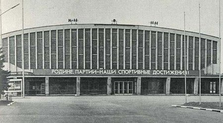
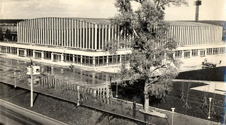
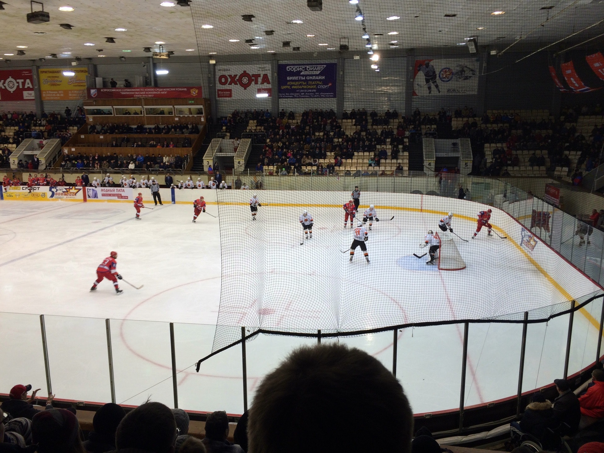

[Назад](/index.md)

### &nbsp;&nbsp;&nbsp;Учреждение культуры и спорта Ледовый дворец «Ижсталь»
&nbsp;&nbsp;&nbsp;&nbsp;&nbsp;Учреждение культуры и спорта Ледовый дворец «Ижсталь» — крытое спортивное сооружение, расположенное в городе Ижевске на улице Удмуртской.
&nbsp;&nbsp;&nbsp;&nbsp;&nbsp;На протяжении многих лет существования поселка при Ижевском заводе единственным кладбищем будущего города оставалось Троицкое. По словам историков, там было захоронено около 140 тысяч жителей поселка, в том числе - начальники завода, генералы, оружейники, а также знаменитый Семен Дудин, первый зодчий нашего города. В 1930 году кладбище было закрыто, а в 1950 его отдали под застройку.
&nbsp;&nbsp; 
&nbsp;&nbsp;&nbsp;&nbsp;&nbsp;Сейчас на территории бывшего кладбища стоит не только ледовый дворец «Ижсталь», но и стадион «Зенит», бассейн «Динамо» и другие сооружения. Единственное свидетельство о кладбище находится во дворе сохранившегося кладбищенского Свято-Троицкого собора - небольшая ротонда с памятной доской.
&nbsp;&nbsp;&nbsp;&nbsp;&nbsp;Некоторые ижевчане помнят, как при строительстве этих объектов находили останки похороненных на Троицком кладбище. Литератор Сергей Жилин в одной из своих статей пишет: «Я сам в толпе любопытствующих пацанов частенько бывал на строительстве Ледового дворца, видел черепа и истлевшие гробы тех, кто жил в этом городе задолго до меня».
&nbsp;&nbsp;&nbsp;&nbsp;&nbsp;&nbsp;&nbsp;&nbsp;&nbsp;&nbsp;&nbsp;&nbsp;&nbsp;&nbsp;&nbsp;&nbsp;&nbsp;&nbsp;&nbsp;&nbsp;&nbsp;&nbsp;&nbsp;&nbsp;&nbsp;&nbsp;&nbsp;&nbsp;&nbsp;&nbsp;&nbsp;&nbsp;&nbsp;&nbsp;&nbsp;&nbsp;&nbsp;&nbsp;&nbsp;&nbsp;&nbsp;&nbsp;&nbsp;&nbsp;&nbsp;&nbsp;&nbsp;&nbsp;&nbsp;&nbsp;
&nbsp;&nbsp;&nbsp;&nbsp;&nbsp;В настоящее время в ледовом дворце базируется СДЮСШОР «Ижсталь». Проводятся концерты, ледовые шоу, выставки и иные культурные мероприятия. Также в  «Ижстали» действуют массажный и процедурный кабинеты, спортивный и тренажёрный залы, бассейн, баня, сауна. Работают залы русского и американского бильярда, танцевальный зал, кафе, пресс-центр, экспозиция, посвященная истории дворца и хоккейного клуба, спортивный зал, имеются профессиональные теннисные столы. Под сводами арены имеется киоск, где продается форма и атрибутика клуба, эксклюзивные подарочные товары.
&nbsp;&nbsp;&nbsp;&nbsp;&nbsp;Общая площадь ледового дворца: 11 056 кв. м.
&nbsp;&nbsp;&nbsp;&nbsp;&nbsp;Число мест: 3 800. Для сравнения, республиканский цирк вмещает 1 800 зрителей.
&nbsp;&nbsp;&nbsp;&nbsp;&nbsp;Температура воздуха в зале: около +19° С (осенью и весной, когда на улице еще холодно, а отопление еще не дали, фойе и зал дворца остывают до +14° С). Лед на арене не тает за счет работы холодильных установок.
&nbsp;&nbsp;&nbsp;&nbsp;&nbsp;Лед занят ежедневно с 6:00 до 23:00. Час отводится на тренировку команды, 15 минут - на обновление льда. Сейчас в Ледовом тренируются игроки ХК «Ижсталь» и других клубов, спортсмены Детской спортивной школы хоккея, любительские команды, по воскресеньям проходят катания для всех желающих.
&nbsp;&nbsp; 