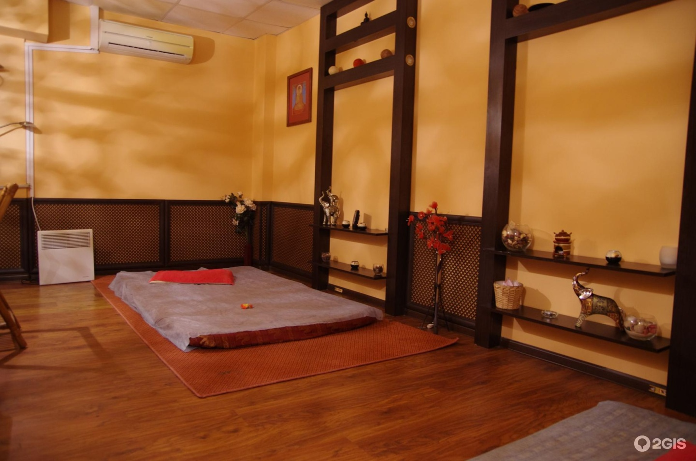

&nbsp;&nbsp;&nbsp;&nbsp;&nbsp;[Назад](/zdorovii_turism.md)

### &nbsp;&nbsp;&nbsp;Тайский СПА-салон MaiTai

&nbsp;&nbsp;&nbsp;&nbsp;&nbsp;Cеть салонов MaiTai по праву является самой большой сетью тайских СПА в Ижевске. Салоны расположены в удобных местах города, что делает их особенно привлекательными.

&nbsp;&nbsp;&nbsp;&nbsp;&nbsp;В салонах работают приветливые, улыбчивые и гостеприимные мастера своего дела с опытом работы в лучшиx отелях мира от 7 лет.

&nbsp;&nbsp;&nbsp;&nbsp;&nbsp;В работе используется гипоаллергенная тайская косметика, которую гость может попробовать и приобрести.

&nbsp;&nbsp;&nbsp;&nbsp; 

&nbsp;&nbsp;&nbsp;&nbsp;&nbsp;Салон MaiTai предоставляет такие услуги, как:
- Тайские программы (Арома-оил, Оил-антистресс, Королевская программа в 4 руки, Здоровая спина, Фут-восстановление и др.);
- SPA-уход (Обертывание тела, Скраб тела, Шоколадные процедуры, Антицеллюлитная программа и др.);
- Романтические программы для двоих;
- СПА-день;
- Девичники;
- Йога.

&nbsp;&nbsp;&nbsp;&nbsp;&nbsp;Режим работы: Пн-вс: 9:00-21:00.