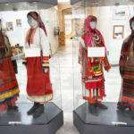
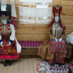
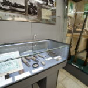
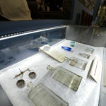
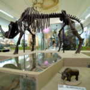
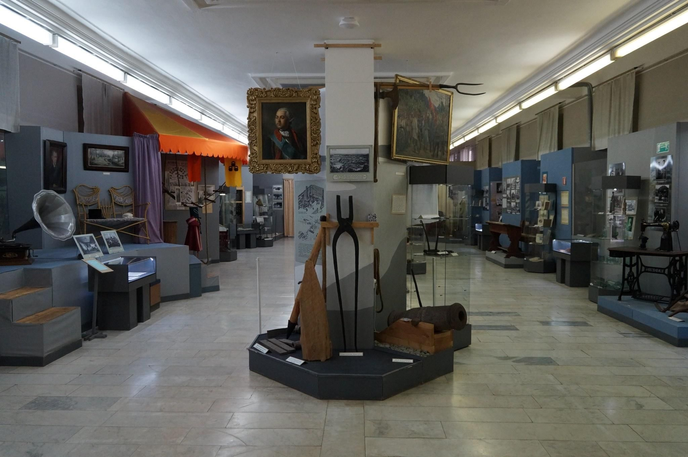
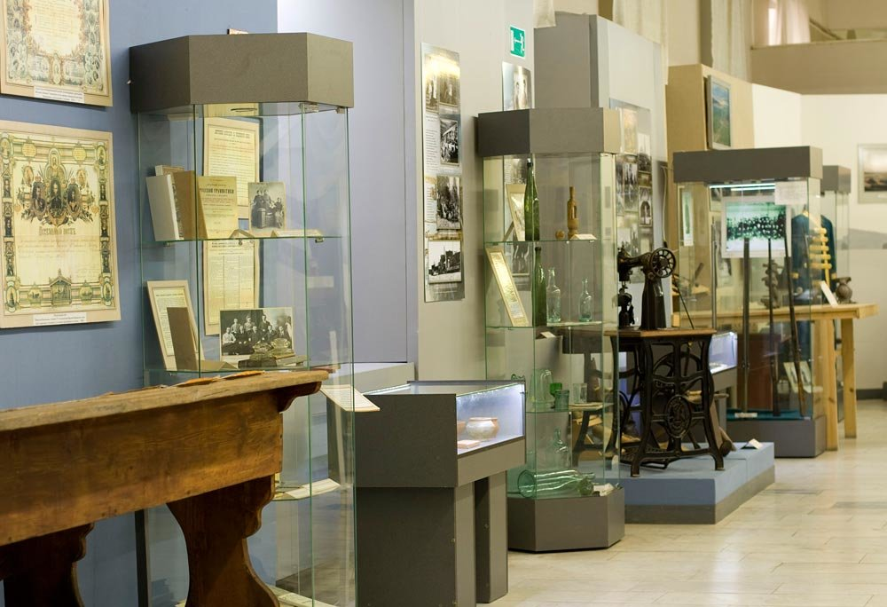

[Назад](/index.md)

### &nbsp;&nbsp;&nbsp;Национальный музей Удмуртской Республики имени Кузебая Герда
&nbsp;&nbsp;&nbsp;&nbsp;&nbsp;История Национального музея Удмуртской Республики, в настоящий момент крупнейшего научно-исследовательского, культурно-просветительного и методического центра Удмуртской Республики, - это история становления и развития краеведения в республике.
&nbsp;&nbsp;&nbsp;&nbsp;&nbsp;Основан Исполкомом Ижевского городского Совета как Ижевский музей местного края в ноябре 1920 г. С 2000 г. - Национальный музей Удмуртской Республики имени Кузебая Герда. К. Герд (К.П. Чайников) (1898 - 1937) - выдающийся деятель удмуртской интеллигенции ХХ века, профессиональный поэт, просветитель, директор музея с 1925 по 1926 гг.
&nbsp;&nbsp;&nbsp;&nbsp;&nbsp;Экспозиция представляет собой систему выставок, дающих представление о природе и истории края, являющегося исторической прародиной финно-угорских народов. Этническая история проживающих в республике удмуртов, русских, марийцев и татар представлена в богатых коллекциях и музейных комплексах национальной одежды, утвари и других предметах, рассказывающих о жизни, обычаях и обрядах, религии народов края. Удмурты - один из немногих народов мира, сохраняющих язычество.
 
&nbsp;&nbsp;&nbsp;&nbsp;&nbsp;Удмуртия, и в частности Ижевск, известны в мире как кузница армейского, охотничьего и спортивного оружия. Экспозиции по истории Ижевского оружия и военной истории края - объект постоянного интереса российских и иностранных туристов всех возрастов.
&nbsp;&nbsp;&nbsp;&nbsp;&nbsp;Музей является победителем конкурса "Меняющийся музей в меняющемся мире" 2006 г. - проект "Гражданская эстафета", 2007 г. - проект "Музейный телеклуб межнациональных семей "Счастье в доме. ru" и 2010 г. - проект "Музеи региона: новая волна".

&nbsp;&nbsp;&nbsp;&nbsp;&nbsp;Разделы экспозиции:
- «Память веков» 
Древняя и средневековая история края VIII тыс. до н.э. – XV в. Происхождение удмуртского этноса.
- «Мы - удмурты».
Экспозиция раскрывает картину мира удмуртов XVI—XX вв. В воссозданной деревне можно познакомиться с культурой и бытом местных жителей, их ремеслами и верованиями, выраженными в связи человека с природой.
&nbsp;&nbsp;&nbsp;&nbsp;&nbsp;&nbsp;&nbsp;&nbsp;&nbsp;&nbsp;&nbsp;&nbsp;&nbsp;&nbsp;&nbsp;&nbsp;&nbsp;&nbsp;&nbsp;&nbsp;&nbsp;&nbsp;&nbsp;&nbsp; &nbsp;&nbsp; &nbsp;&nbsp; 
- «А торг – дело великое».
Этот зал музея «Арсенал» Ижевска посвящен ярмаркам XIX–XX веков. Посетителям предлагается посмотреть на местный фотосалон и сделать памятную фотографию.
- «Города начинались с заводов».
Заводы представлены как важные факторы в развитии края и его культурной жизни. Здесь оформлены заводские цеха с выпускаемой продукцией, можно увидеть фотографии, документы, афиши тех лет. В зале также воссоздана обстановка различных городских мест и учреждений: начальной школы, больницы, сада, цирка и театра.
&nbsp;&nbsp;&nbsp;&nbsp;&nbsp;&nbsp;&nbsp;&nbsp;&nbsp;&nbsp;&nbsp;&nbsp;&nbsp;&nbsp;&nbsp;&nbsp;&nbsp;&nbsp;&nbsp;&nbsp;&nbsp;&nbsp;&nbsp;&nbsp; &nbsp;&nbsp; &nbsp;&nbsp; 
- «Геннадий Красильников. Выбор пути» 
 Экспозиция поднимает современные вопросы как частной, так и общеэтнической судьбы. Один из них: как усвоить чужую культуру, не изменив своей. Впервые в экспозиции представлены документы личной переписки, романтические фотографии студенческой поры, уникальные свидетельства напряжённой внутренней жизни писателя. В течение сорока минут вы сможете побывать в трёх географических точках, оказавших влияние на всю дальнейшую жизнь писателя и, совершив собственный выбор, почувствовать атмосферу далёких 50-х, незабываемых 60-х и удушающих 70-х гг. ХХ века.
 &nbsp;&nbsp; &nbsp;&nbsp; &nbsp;&nbsp; 

&nbsp;&nbsp;&nbsp;&nbsp;&nbsp;Постоянные экспозиции: 
- «Природа Удмуртии».
Посетители узнают о животных и растениях, которых можно было увидеть на территории республики много тысяч лет назад. На стене представлены следы различных древних обитателей. В зале также выставлены чучела зверей из местных лесов, оформлен стенд о городских обитателях. Для детей приготовлены различные игры.
&nbsp;&nbsp; &nbsp;&nbsp; &nbsp;&nbsp; 
- «История и культура края VIII тыс. до н.э.-нач. XX в».
Здесь экспонируются результаты археологических раскопок на территории республики. Они повествуют об истории края с VIII века до н. э. по XХ век н. э.: где проживали люди, как обустраивали свои жилища, чем занимались, какие проводили обряды.
&nbsp;&nbsp; &nbsp;&nbsp; &nbsp;&nbsp; 
&nbsp;&nbsp;&nbsp;&nbsp;&nbsp;Стоимость входных билетов зависит от осматриваемого зала:
&nbsp;&nbsp;&nbsp;&nbsp;&nbsp;«Историческая экспозиция»: взрослые — 180 руб., студенты — 90 руб., пенсионеры — 80 руб., школьники — 60 руб., дети 3–7 лет — 40 руб.
&nbsp;&nbsp;&nbsp;&nbsp;&nbsp;«Природа Удмуртии»: взрослые — 190 руб., студенты — 110 руб., пенсионеры — 100 руб., школьники — 70 руб., дети 3–7 лет — 50 руб.
&nbsp;&nbsp;&nbsp;&nbsp;&nbsp;Временные выставки: взрослые — 120 руб., студенты, пенсионеры и школьники — 60 руб., дети 3–7 лет — 40 руб.
&nbsp;&nbsp;&nbsp;&nbsp;&nbsp;Режим работы: 
&nbsp;&nbsp;&nbsp;&nbsp;&nbsp;Пн — выходной.
&nbsp;&nbsp;&nbsp;&nbsp;&nbsp;Вт-Вс: 10:00 — 18:00.
&nbsp;&nbsp;&nbsp;&nbsp;&nbsp;Чт: 13:00 — 21:00.