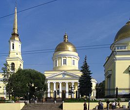

[Назад](/index.md)

### &nbsp;&nbsp;&nbsp;Александро-Невский кафедральный собор
&nbsp;&nbsp;&nbsp;&nbsp;&nbsp;В результате пожара 1810 года были уничтожены значительная часть города и главный в то время храм — церковь Ильи Пророка, встал вопрос о строительстве нового храма. Уже на следующий год заводской архитектор С. Е. Дудин, выполнил проект монументального собора с тремя престолами и тремя колокольнями, но проект был отвергнут, в связи с излишней пышностью и дороговизной. Взамен отвергнутого проекта петербургские власти рекомендовали взять в качестве образца проект Андреевского собора в Кронштадте. Дудин откорректировал чертежи, исходя из местных условий, например, заменил гранит на заводское литье, а также упростил отдельные архитектурные формы.
&nbsp;&nbsp;&nbsp;&nbsp;&nbsp;Строительство завершилось в 1823 году. Центральный придел был освящен в честь святого благоверного князя Александра Невского, южный предел — в честь святой великомученицы Екатерины, северный — в честь Казанской иконы Божией Матери, нижний, «пещерный» храм — в честь святых мучеников Власия и Модеста.
&nbsp;&nbsp;&nbsp;&nbsp;&nbsp;&nbsp;&nbsp;&nbsp;&nbsp;&nbsp;&nbsp;&nbsp;&nbsp;&nbsp;&nbsp;&nbsp;&nbsp;&nbsp;&nbsp;&nbsp;&nbsp;&nbsp;&nbsp;&nbsp;&nbsp;&nbsp;&nbsp;&nbsp;&nbsp;&nbsp;&nbsp;&nbsp;&nbsp;&nbsp;&nbsp;&nbsp;&nbsp;&nbsp;&nbsp;&nbsp;&nbsp;&nbsp;&nbsp;&nbsp;&nbsp;&nbsp;&nbsp;&nbsp;&nbsp;&nbsp;&nbsp;&nbsp;&nbsp;&nbsp;&nbsp;&nbsp;&nbsp;&nbsp;&nbsp;&nbsp;&nbsp;&nbsp;&nbsp;&nbsp;
&nbsp;&nbsp;&nbsp;&nbsp;&nbsp;В 1824, проезжая через Ижевск, собор посетил император Александр I. В 1871 году при Соборе открылось попечительство, которое занималось просветительской благотворительной работой. С 1875 года при храме действовала воскресная школа. Позднее при соборе образованы и другие школы, благотворительные комиссии и общество трезвости.
&nbsp;&nbsp;&nbsp;&nbsp;&nbsp;В 1929 году собор был закрыт по требованию юношеской секции Союза воинствующих безбожников, и в том же году разрушили колокольню и переоборудовали собор под клуб. С 1930 года здание собора служило как детский клуб и кинотеатр, позднее как музей атеизма. В 1932 году, после новой реконструкции, в здании бывшего собора открылся кинотеатр «Колосс». В 1937 году был разобран купол храма, после этого изуродованное здание было причислено к «памятникам архитектуры I категории».
&nbsp;&nbsp;&nbsp;&nbsp;&nbsp;&nbsp;&nbsp;&nbsp;&nbsp;&nbsp;&nbsp;&nbsp;&nbsp;&nbsp;&nbsp;&nbsp;&nbsp;&nbsp;&nbsp;&nbsp;&nbsp;&nbsp;&nbsp;&nbsp;&nbsp;&nbsp;&nbsp;&nbsp;&nbsp;&nbsp;&nbsp;&nbsp;&nbsp;&nbsp;
&nbsp;&nbsp;&nbsp;&nbsp;&nbsp;Собор был возвращен верующим в 1990 году и после подготовки проекта реставрации в 1992 году начались работы по возрождению собора. К концу 1993 года ремонт был завершён, на территории собора построены новый крестильный храм, иордань для освящения воды, звонница и 2 января 1994 года состоялось освящение собора. 
&nbsp;&nbsp; &nbsp;&nbsp; 

&nbsp;&nbsp;&nbsp;&nbsp;&nbsp;Время работы собора: пн-сб с 7:00 до 19:00, вс с 6:30 до 18:00